# Carefully Built SaaS Kit

Reusable packages for building B2B SaaS apps with React, Next.js, Convex, WorkOS, and strongly typed CRUD/resource patterns.

The goal of this repo is to collect the boring-but-important SaaS building blocks once, keep them polished, and reuse them across projects instead of rebuilding tables, filters, organization flows, CRUD screens, and dashboard shells every time.

## Component Gallery

Reusable CRM/SaaS primitives included in the kit.

### SmartTable

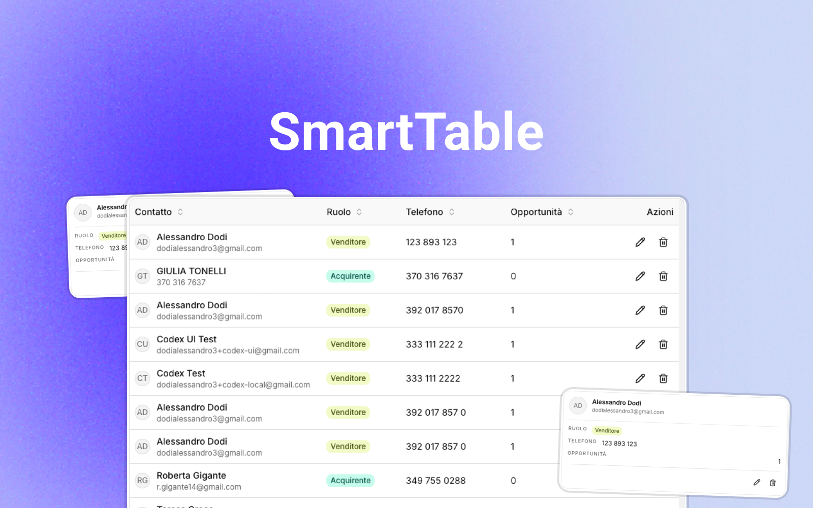

Use `SmartTable` for dense CRM lists with sortable columns, row actions, mobile cards, and consistent empty/loading behavior. [Read the UI docs](./docs/packages/ui.md).

### ResponsiveSheet

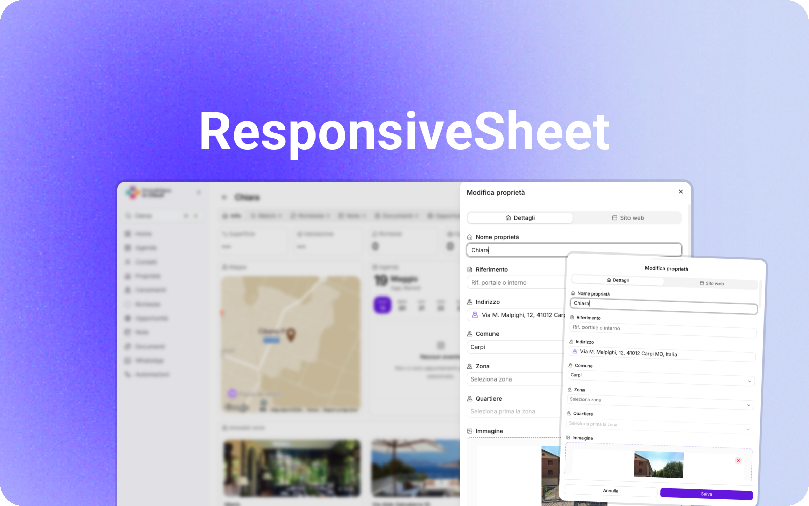

Use `ResponsiveSheet` for create/edit/detail workflows that open as a desktop side panel and adapt cleanly on mobile. [Read the UI docs](./docs/packages/ui.md).

### Search

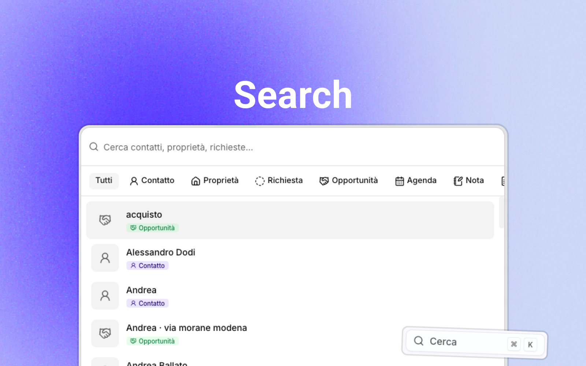

Use the search package for command-palette style navigation, fuzzy matching, ranked results, and app-wide quick actions. [Read the search docs](./docs/packages/search.md).

### Sidebar

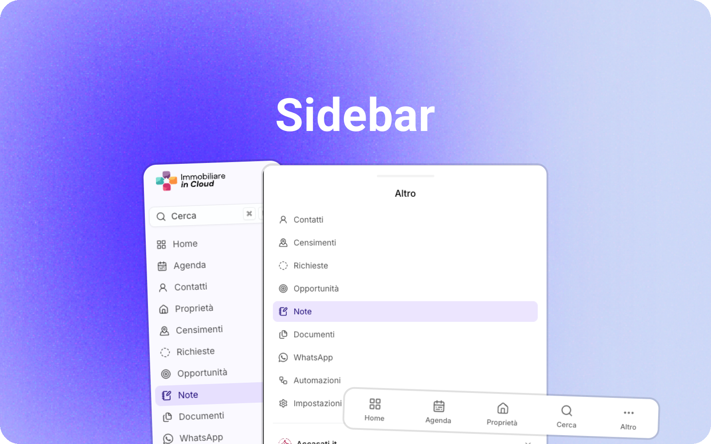

Use the app shell primitives to compose dashboard navigation, active states, responsive layout, footer actions, and mobile navigation. [Read the app shell docs](./docs/packages/app-shell.md).

### OrgSwitcher

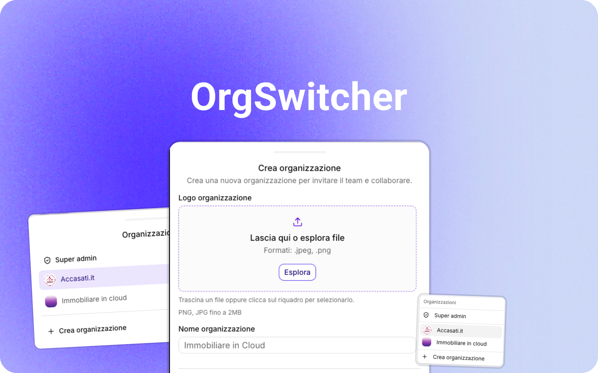

Use `SidebarOrgSwitcherBase` and WorkOS helpers for organization switching, organization creation, and logo upload flows. [Read the WorkOS docs](./docs/packages/workos.md).

### SuperAdmin

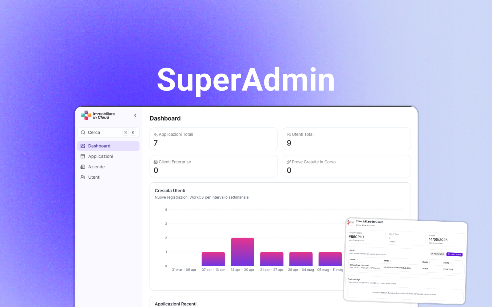

Use the superadmin package for internal admin routes, application access, users, companies, feature flags, metrics, and audit-friendly admin lists. [Read the superadmin docs](./docs/packages/superadmin.md).

### Kanban

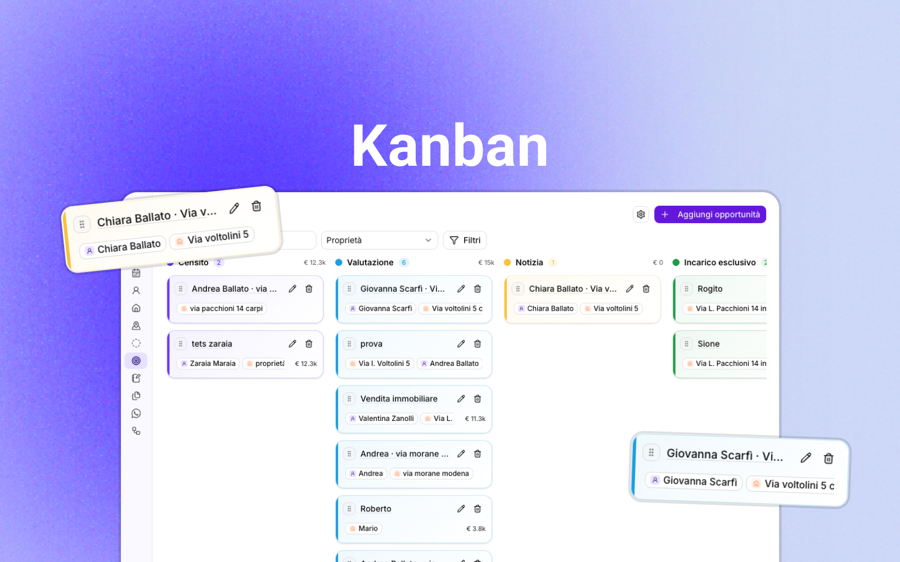

Use `KanbanBoard`, `KanbanCard`, and pipeline helpers for status-based workflows such as deals, tickets, tasks, and approvals. [Read the kanban docs](./docs/packages/kanban.md).

### Charts

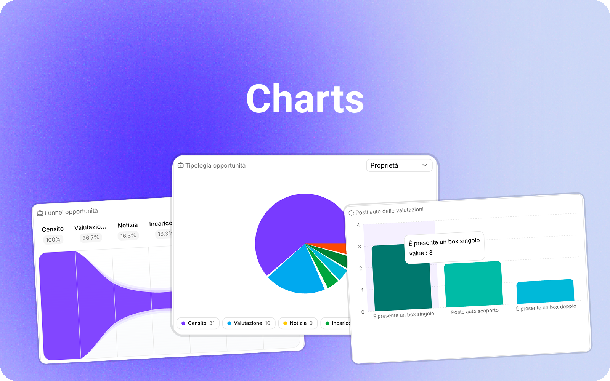

Use the chart widgets for compact dashboard analytics, legends, bar distributions, and donut charts fed by app-specific data. [Read the charts docs](./docs/packages/charts.md).

### Calendar

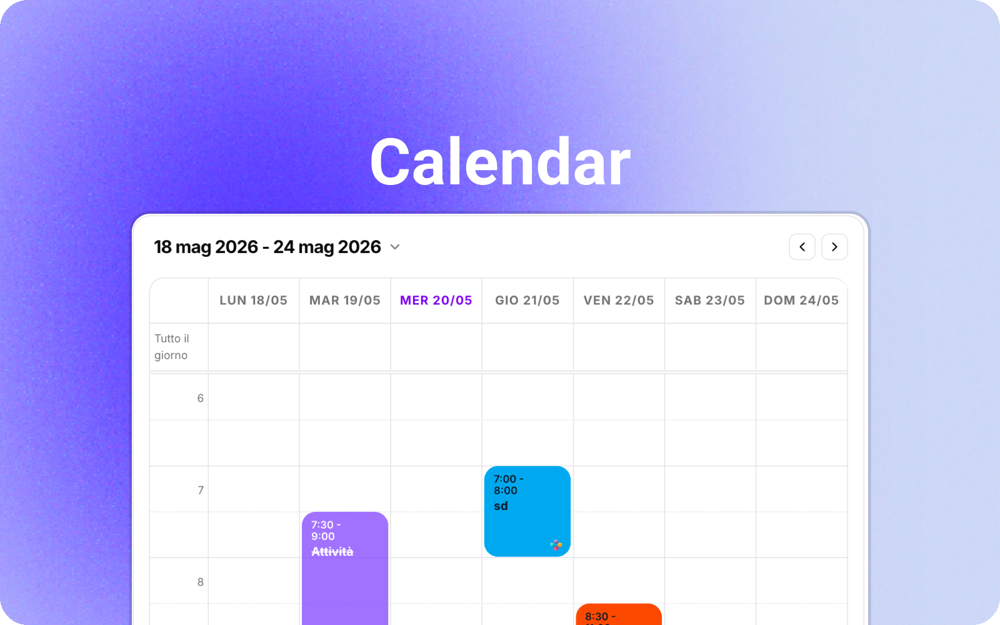

Use the agenda package for scheduled activities, calendar widgets, list views, date utilities, and responsive calendar scopes. [Read the agenda docs](./docs/packages/agenda.md).

### Documents

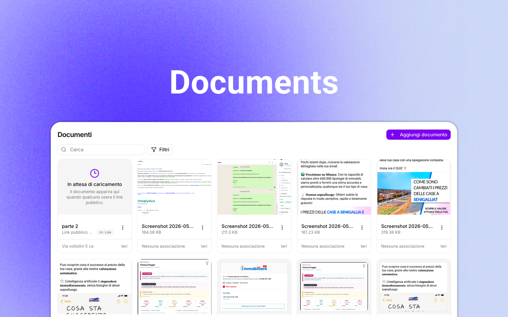

Use the files package for document cards, document sheets, previews, filters, public upload helpers, and association summaries. [Read the files docs](./docs/packages/files.md).

### File Dropper

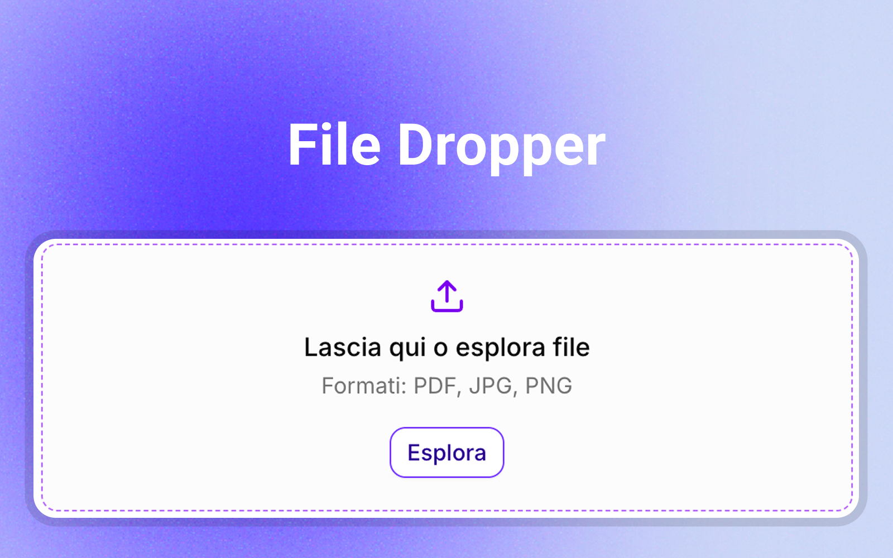

Use `FileDropzone` for reusable drag-and-drop upload inputs, accepted-file hints, validation states, and form integration. [Read the UI docs](./docs/packages/ui.md).

### Notifications

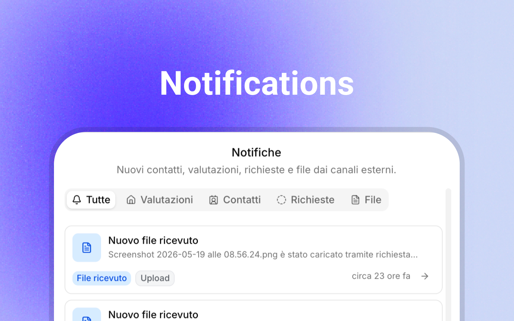

Use the notifications package for a notification button, sheet, tabs, visual metadata, and controlled notification lists. [Read the notifications docs](./docs/packages/notifications.md).

### Widgets

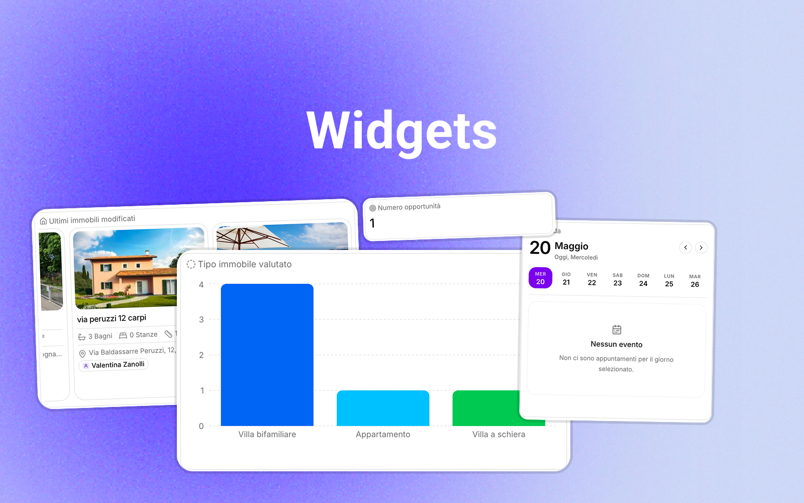

Use `DashboardWidget` and `EntityInfoWidget` to build reusable dashboard panels, detail-page blocks, and empty states. [Read the widgets docs](./docs/packages/widgets.md).

### Theme Switcher

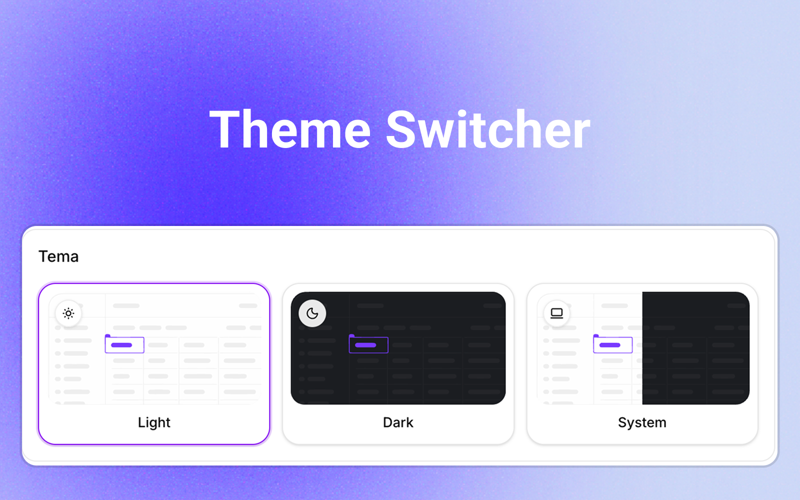

Use `ThemeSelector` for light, dark, and system mode selection with reusable theme option metadata. [Read the theme UI docs](./docs/packages/theme-ui.md).

### Maps

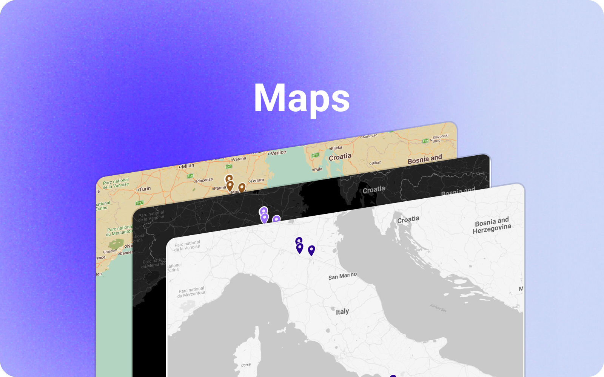

Use the maps package for Google Maps loading, Places autocomplete fields, normalized place values, and attribution helpers. [Read the maps UI docs](./docs/packages/maps-ui.md).

### Maps Theme

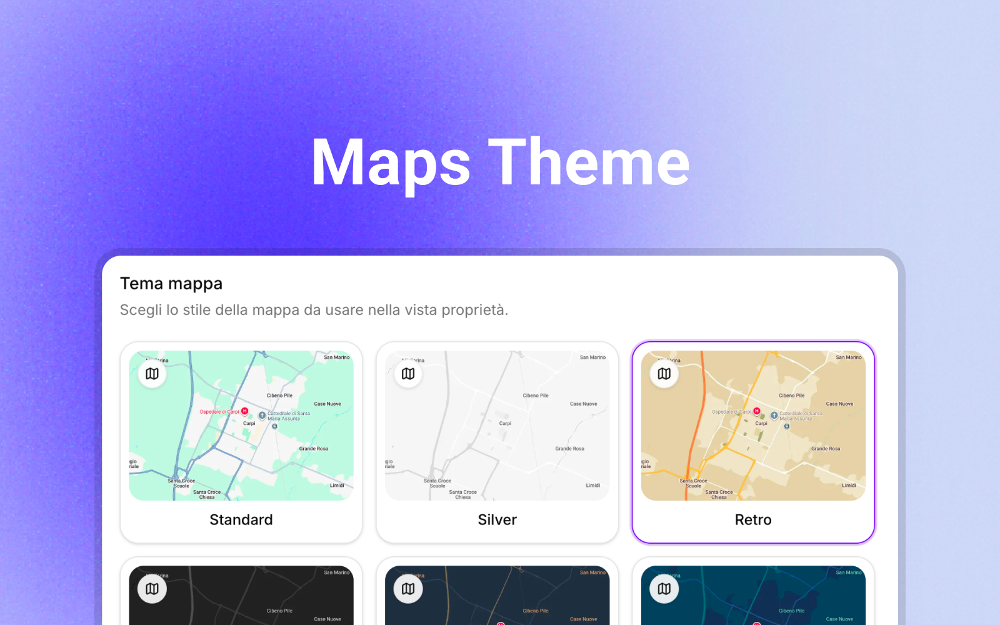

Use `MapThemeSelector` and map theme constants to let apps switch between reusable Google Maps visual themes. [Read the theme UI docs](./docs/packages/theme-ui.md).

## Packages

| Package | Version | Purpose |
|---|---:|---|
| [`@carefully-built/agenda`](./docs/packages/agenda.md) | 0.1.5 | Reusable agenda helpers, activity lists, time utilities, and activity type primitives for SaaS apps. |
| [`@carefully-built/agent-picker`](./docs/packages/agent-picker.md) | 0.1.0 | Reusable agent/user picker for SaaS forms. |
| [`@carefully-built/app-shell`](./docs/packages/app-shell.md) | 0.1.2 | Reusable dashboard shell primitives for Carefully Built SaaS apps. |
| [`@carefully-built/association-picker`](./docs/packages/association-picker.md) | 0.1.1 | Reusable entity association picker for multitenant SaaS apps. |
| [`@carefully-built/auth-pages`](./docs/packages/auth-pages.md) | 0.1.7 | Reusable SaaS auth pages, layouts, legal consent, and form presentation for Carefully Built apps. |
| [`@carefully-built/automations`](./docs/packages/automations.md) | 0.1.1 | Reusable automation builder primitives, canvas, options, and draft validation for SaaS apps. |
| [`@carefully-built/charts`](./docs/packages/charts.md) | 0.1.1 | Reusable chart widgets, cards, and legends for Carefully Built SaaS apps. |
| [`@carefully-built/convex-crud`](./docs/packages/convex-crud.md) | 0.1.8 | Reusable Convex CRUD audit, archive, and organization-record helpers. |
| [`@carefully-built/convex-multitenant`](./docs/packages/convex-multitenant.md) | 0.1.2 | Reusable Convex multitenant guards and organization-scoped lookup helpers. |
| [`@carefully-built/convex-platform`](./docs/packages/convex-platform.md) | 0.1.7 | Reusable Convex SaaS platform helpers for org-scoped CRUD, entity associations, and multitenant apps. |
| [`@carefully-built/convex-workos`](./docs/packages/convex-workos.md) | 0.1.0 | Reusable Convex helpers for syncing WorkOS users across base and organization-scoped records. |
| [`@carefully-built/crud`](./docs/packages/crud.md) | 0.1.2 | Config-driven CRUD table and form helpers for Carefully Built SaaS apps. |
| [`@carefully-built/custom-fields`](./docs/packages/custom-fields.md) | 0.1.2 | Reusable custom-field options, form mapping, payload building, and display helpers for SaaS apps. |
| [`@carefully-built/files`](./docs/packages/files.md) | 0.1.4 | Reusable file and document UI primitives, previews, filters, and association helpers for SaaS apps. |
| [`@carefully-built/forms`](./docs/packages/forms.md) | 0.1.4 | Reusable React Hook Form fields and schema-driven form helpers for Carefully Built SaaS apps. |
| [`@carefully-built/import-export`](./docs/packages/imports.md) | 0.1.2 | Reusable tabular import/export sheets, CSV parsing, preview rows, and contact import examples for SaaS apps. |
| [`@carefully-built/kanban`](./docs/packages/kanban.md) | 0.1.0 | Reusable Kanban board and card primitives for SaaS pipelines. |
| [`@carefully-built/legal-ui`](./docs/packages/legal-ui.md) | 0.1.1 | Reusable legal document renderer for Carefully Built SaaS apps. |
| [`@carefully-built/maps-ui`](./docs/packages/maps-ui.md) | 0.1.3 | Reusable Google Maps UI, map themes, and attribution helpers for Carefully Built apps. |
| [`@carefully-built/notes`](./docs/packages/notes.md) | 0.1.2 | Reusable notes cards, grids, helpers, and editor shell pieces for SaaS apps. |
| [`@carefully-built/notifications`](./docs/packages/notifications.md) | 0.1.0 | Reusable notification center UI for Carefully Built SaaS apps. |
| [`@carefully-built/resource-kit`](./docs/packages/resource-kit.md) | 0.1.2 | Reusable resource-page state helpers for CRUD SaaS surfaces. |
| [`@carefully-built/rich-text`](./docs/packages/rich-text.md) | 0.1.0 | Reusable rich text editor, renderer, AI action affordances, and serialization helpers for SaaS apps. |
| [`@carefully-built/search`](./docs/packages/search.md) | 0.1.1 | Reusable fuzzy search and ranking helpers for Carefully Built SaaS apps. |
| [`@carefully-built/settings-ui`](./docs/packages/settings-ui.md) | 0.1.4 | Reusable SaaS settings tabs, section cards, and settings metrics for Carefully Built apps. |
| [`@carefully-built/superadmin`](./docs/packages/superadmin.md) | 0.1.8 | Reusable superadmin UI for Carefully Built SaaS apps. |
| [`@carefully-built/theme-ui`](./docs/packages/theme-ui.md) | 0.1.0 | Reusable SaaS theme, map theme, color, and shape selectors for Carefully Built apps. |
| [`@carefully-built/ui`](./docs/packages/ui.md) | 0.1.15 | Reusable React UI primitives and data-display components for Carefully Built SaaS apps. |
| [`@carefully-built/widgets`](./docs/packages/widgets.md) | 0.1.0 | Reusable SaaS dashboard and detail widgets for Carefully Built apps. |
| [`@carefully-built/workos`](./docs/packages/workos.md) | 0.1.2 | Reusable WorkOS organization creation and organization logo primitives for SaaS apps. |

## Documentation

- [Package docs](./docs/packages/README.md)
- [Component catalog](./docs/components/README.md)
- [Full API catalog](./docs/api.md)

Every exported component/helper should be discoverable from the generated docs. Package docs explain import paths, basic usage, exported API, consumer responsibilities, and package responsibilities.

## Development

```bash
bun install
bun run docs
bun run typecheck
bun run build
```

Packages are designed to be published publicly, but can also be consumed locally with file/tarball dependencies while they are under active development.

## Maintenance Rules

- Keep app/domain behavior in the consuming app.
- Move reusable SaaS platform behavior into these packages.
- Run `bun run docs` after adding or renaming exports.
- Update package READMEs manually when behavior, constraints, or required adapters change.
